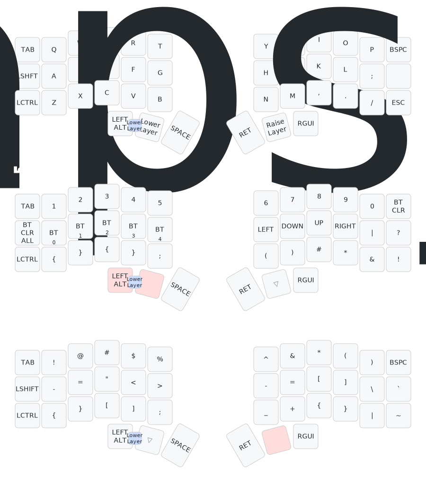

# ZMK Config - Split Keyboard Setup

This repository contains the ZMK (Zephyr Mechanical Keyboard) firmware configuration for a split keyboard setup using the Corne (CRKBD) keyboard layout with nRFMicro 1.3 controllers.

## 🔧 Hardware

- **Keyboard**: Corne (CRKBD) - 42-key split ergonomic keyboard
- **Controllers**: nRFMicro 1.3 (wireless)
- **Layout**: 3x6 + 3 thumb keys per side

## 📝 Keymap Layout

This configuration features a 3-layer keymap designed for efficient programming and daily use:

### Layer 0: Default Layer (Base/QWERTY)



The default layer provides a standard QWERTY layout with:

- Standard QWERTY alpha keys
- Tab, Ctrl, Shift modifiers in comfortable positions
- Space and Enter on thumb keys
- Layer access via momentary holds (Lower/Raise)

### Layer 1: Lower Layer (Numbers & Navigation)

The lower layer includes:

- **Numbers**: 1-9, 0 on the top row
- **Bluetooth Controls**: BT Clear and device selection (BT0-BT4)
- **Arrow Keys**: Navigation arrows on the right side
- **Function**: Accessed by holding the left thumb key

### Layer 2: Raise Layer (Symbols & Special Characters)

The raise layer provides:

- **Symbols**: !, @, #, $, %, ^, &, \*, (, )
- **Brackets**: [], {}, ()
- **Special Characters**: \, |, `, ~, -, \_, =, +
- **Function**: Accessed by holding the right thumb key

## ⚡ Features

### Bluetooth Configuration

The firmware includes optimized Bluetooth settings for reliable wireless connectivity:

- Enhanced TX power (+8dBm) for better range
- Experimental connection improvements
- Proper battery level reporting for split keyboards
- GATT subscription enforcement disabled for compatibility

### Power Management

- **Sleep Mode**: Keyboard enters sleep mode to conserve battery
- **Battery Reporting**: Both halves report battery levels correctly
- **Split Battery Proxy**: Central half reports peripheral battery status

## 🚀 Building & Flashing

This configuration is set up for GitHub Actions automatic building. The build matrix in `build.yaml` generates firmware for both keyboard halves:

- `corne_left` - Left half firmware
- `corne_right` - Right half firmware

### Manual Building

If you want to build locally:

```bash
west build -p -b nrfmicro_13 -- -DSHIELD=corne_left
west build -p -b nrfmicro_13 -- -DSHIELD=corne_right
```

## 📁 Project Structure

```
├── build.yaml              # GitHub Actions build configuration
├── config/
│   ├── corne.conf          # Keyboard-specific settings
│   ├── corne.keymap        # Keymap definition
│   └── west.yml            # West workspace configuration
├── keymap-drawer/
│   └── img/
│       ├── corne.svg       # Visual keymap representation
│       └── corne.yaml      # Keymap drawer configuration
└── boards/shields/         # Custom board definitions (if any)
```

## 🎨 Keymap Visualization

The keymap layout is visualized using [keymap-drawer](https://github.com/caksoylar/keymap-drawer). The SVG representation shows all layers and key assignments for easy reference.

## 🔄 Customization

To customize this keymap:

1. **Modify Keybindings**: Edit `config/corne.keymap` to change key assignments
2. **Adjust Settings**: Update `config/corne.conf` for feature toggles
3. **Update Visualization**: Regenerate `keymap-drawer/img/corne.yaml` and SVG after changes

### Key Binding Reference

- `&kp KEY` - Key press
- `&mo LAYER` - Momentary layer activation
- `&bt BT_SEL N` - Select Bluetooth device N
- `&bt BT_CLR` - Clear Bluetooth bonds
- `&trans` - Transparent (pass through to lower layer)

## 🤝 Contributing

Feel free to fork this repository and adapt it for your own split keyboard setup. If you have improvements or optimizations, pull requests are welcome!

## 📚 Resources

- [ZMK Documentation](https://zmk.dev/)
- [Corne Keyboard](https://github.com/foostan/crkbd)
- [nRFMicro](https://github.com/joric/nrfmicro)
- [Keymap Drawer](https://github.com/caksoylar/keymap-drawer)

---

_Happy typing! ⌨️_
